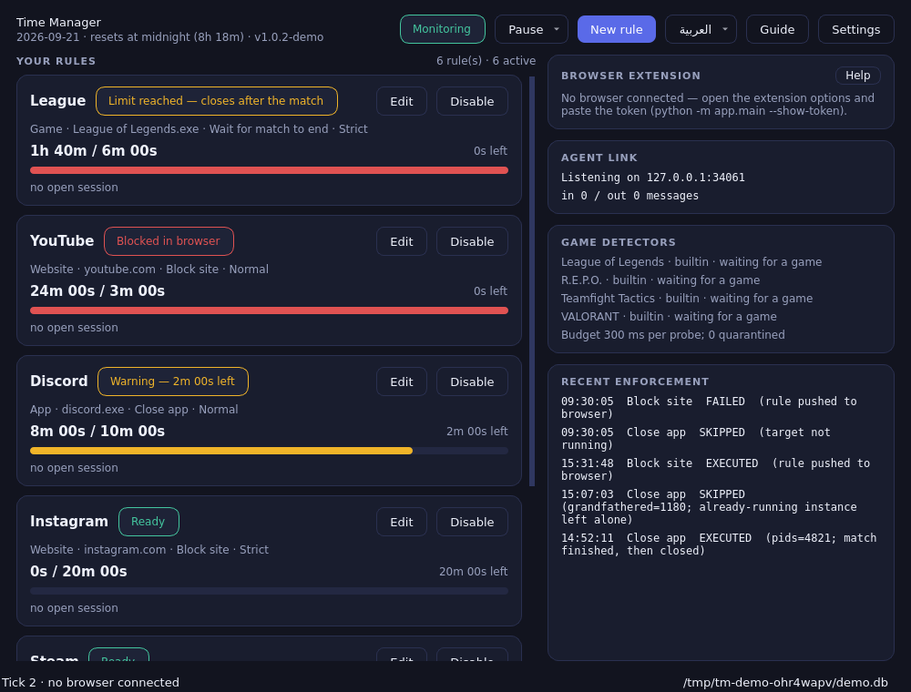
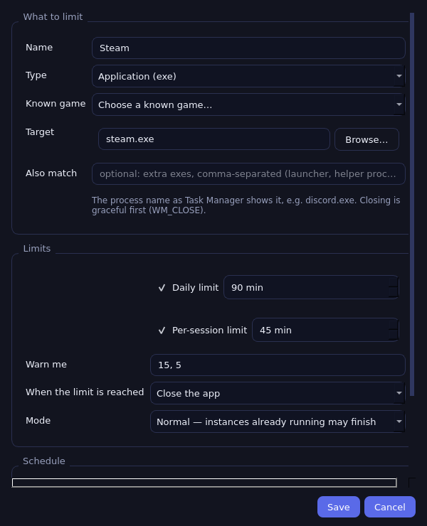
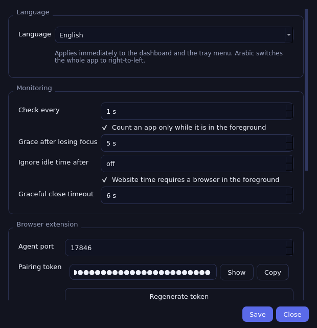
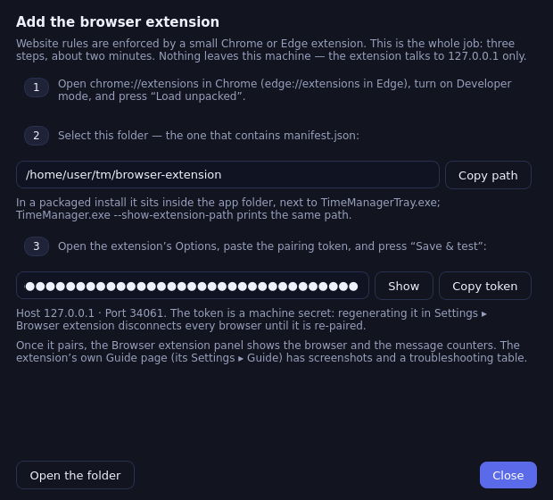

# Time Manager — Windows App, Website & Game Time Manager

A local-first, offline-first personal time-management system for Windows 10/11.
Create rules for the applications, games and websites that eat your day, set
limits, and Time Manager enforces them — intelligently, transparently, and
entirely on your machine.

**Two parts, one system:**

- **Desktop agent** (Python + PySide6): monitors processes and the foreground
  window, tracks usage in SQLite, enforces limits, watches for bypass tricks,
  serves an authenticated local WebSocket for browsers, lives in the System
  Tray, starts with Windows. Packaged as a portable build by PyInstaller.
- **Browser extension** (Manifest V3, Chrome/Edge): reports the *active* tab's
  domain and focus state — time counts only while you are actually looking at
  a page — and renders a local block page when a website limit is reached.

**No cloud. No accounts. No telemetry. Nothing leaves your machine.**

```
League of Legends     ███░░░░░░░  in a match — waits for it to end
YouTube               ████████░░  blocked in browser · resets at midnight
Discord               ██████░░░░  closed at limit · relaunch prevented
```

---

## Install & quick start

**Portable app (recommended):** grab `TimeManager-v<version>-windows-portable.zip`,
unzip anywhere, run **`TimeManagerTray.exe`**. Full instructions — installer,
update, uninstall, troubleshooting — in **[docs/PACKAGING.md](docs/PACKAGING.md)**.

**From source (development):** double-click **`setup.bat`** — it finds Python,
creates the venv, installs everything and verifies with the test suite. Then
double-click **`run.bat`** to start the app. Prefer doing it by hand?

```powershell
py -3.12 -m venv .venv
.venv\Scripts\activate
pip install -r requirements.txt
python -m app.main --gui          # the desktop app: tray + dashboard
pytest -q                         # 597 tests, ~30 s, any OS
```

`setup.bat` flags: `--fresh` rebuilds the venv, `--build` also installs the
PyInstaller build tools, `--no-test` skips the verification. Linux/macOS
developers: `./setup.sh`.

**Want the actual `.exe` files?** Double-click **`build.bat`** — it runs the
test suite, then produces `dist\TimeManager\TimeManagerTray.exe` (the
desktop app) plus a shareable portable zip. See
[docs/PACKAGING.md](docs/PACKAGING.md).

Core-engine work also runs on Linux/macOS; Windows-only features (foreground
window, tray, startup) are guarded and fail with a clear message elsewhere.
`python -m app.main --simulate` plays a deterministic 40-minute demo on a fake
machine — the fastest way to see enforcement happen.

**Connect the browser extension (once):** full walkthrough with
troubleshooting in **[docs/INSTALL-EXTENSION.md](docs/INSTALL-EXTENSION.md)**;

In the app, **Browser extension ▸ Help** shows the same three steps with
*this* install's extension folder and pairing token, each copyable —
no terminal needed.
the short version:

```bash
python -m app.main --show-token             # pairing token for this machine
python -m app.main --show-extension-path    # where the extension lives
```

1. `chrome://extensions` → Developer mode → **Load unpacked** → select the
   `browser-extension/` folder (packaged builds: use `--show-extension-path`;
   the dashboard's *Guide* button points at it too).
2. Extension **Options** → paste the token → Save & test.
3. The agent badge clears when the link is live.

## What it does

| Area | Details |
| --- | --- |
| **App rules** | Daily + session limits, warnings at configurable thresholds, graceful close → forced close, relaunch prevention, schedules (days + time windows), foreground-only accounting. |
| **Website rules** | Domain-normalized matching, counts only the active+focused tab, in-extension block page with reset time, background tabs/minimized browsers never count. |
| **Game rules** | Fail-safe session detectors for League of Legends, VALORANT, R.E.P.O. and Teamfight Tactics — a limit reached mid-match **waits for the match to end**, never interrupts. Drop-in detector plugins for other games. |
| **Strict mode** | Per-rule: relaunch prevention every tick, autostart repair, immunity to pause, usage that survives database tampering. |
| **Anti-bypass** | A killed agent reports the gap at the next start; opt-in Task-Scheduler watchdog revives it within a minute; clock-rollback and extension-silence detection; everything audited and visible (`--security`). |
| **Safety** | Crash recovery, monotonic timing (clock edits can't distort usage), suspend-aware, protected system processes never touched, single instance per profile. |
| **Dashboard** | Live usage bars, state chips, security banner, rule editor with process picker and known-game presets, time-boxed pause (1–480 min), dark/light themes. |
| **Guided tour** | A built-in walkthrough (Guide button / tray menu) that dims the dashboard, spotlights one control at a time and points at it with an arrow. Runs once on a fresh install, never again unless asked. |
| **Extension guide** | The extension ships its own in-browser guide (opens on first install, linked from its options and popup), alongside `docs/INSTALL-EXTENSION.md` and `docs/EXTENSION.md`. |
| **Languages** | English (default) and **العربية** — switch from the header globe, the tray menu or Settings ▸ Language. Applies instantly (no restart), remembers the choice, and flips the whole UI right-to-left. |

## The CLI

| Command | What it does |
| --- | --- |
| `--gui` | Tray icon + dashboard (exit 3 if already running) |
| `--monitor` | Head-less agent loop (this is what the watchdog runs) |
| `--status` / `--status-json` | Human / machine-readable status, safe any time |
| `--security` | Anti-bypass status + the security audit trail |
| `--show-token` / `--regen-token` | Pairing token for the extension |
| `--show-extension-path` | Where the unpacked extension lives in this install |
| `--init-db` | Create/migrate the database, recover sessions, back up |
| `--simulate [MIN]` | Deterministic demo on a fake machine (any OS) |
| `--ipc-selftest` | Real-socket end-to-end browser-link proof |
| `--detector-selftest` | 21-step proof that a match is never interrupted (4 games) |
| `--gui-shot` | Render the dashboard screenshots from the shipping code |

## Games: the fail-safe detector design

Games are tracked like any app, but a limit that lands **mid-match** must not
close the client. Pick the game in the rule editor's *Known game* list, set
*Wait for the match to end*, and the detector decides:

| Situation | Verdict | Result |
| --- | --- | --- |
| match process running (loading, in game, reconnect) | in session, certain | wait |
| match process just disappeared (< 30 s) | unknown (reconnect) | wait |
| champ select / Live Client API / match logs active | in session, probable | wait |
| client alone, settled | no match, certain | enforce |
| detector crashed, hung, or quarantined | unknown | wait |

Nothing a detector does can turn into a closed game: **unknown always means
wait**. Per-game honesty (full tables in [docs/PHASE8.md](docs/PHASE8.md)):
VALORANT's menu and match share one process and R.E.P.O. exposes no session
signal, so those rules wait while the game is up and enforce once it closes —
documented coarseness, not pretended accuracy. TFT shares its match process
with every League mode, so a TFT rule never closes the process while any match
might be live.

## Documentation

| Doc | Contents |
| --- | --- |
| [docs/PACKAGING.md](docs/PACKAGING.md) | Build, install, update, uninstall, troubleshooting |
| [docs/SECURITY-PRIVACY.md](docs/SECURITY-PRIVACY.md) | What is stored, what leaves the machine (nothing), security boundaries, how to verify |
| [docs/ARCHITECTURE.md](docs/ARCHITECTURE.md) | System overview, module responsibilities, data flows, security boundaries |
| [docs/DEVELOPING.md](docs/DEVELOPING.md) | Dev setup, test strategy, recipes (add a detector / rule field), release checklist |
| [docs/DATABASE.md](docs/DATABASE.md) | Every table, the write discipline, schema versions |
| [docs/PROTOCOL.md](docs/PROTOCOL.md) | Browser ↔ agent WebSocket protocol (message shapes, validation) |
| [docs/STATE_MACHINE.md](docs/STATE_MACHINE.md) | The enforcement state machine, per state and transition |
| [docs/TESTING.md](docs/TESTING.md) | Test strategy + the manual on-Windows test plans (incl. the per-game matrix) |
| [docs/LIMITATIONS.md](docs/LIMITATIONS.md) | Honest trade-offs and known ceilings — read this one |
| [docs/PHASE1.md](docs/PHASE1.md) … [PHASE9.md](docs/PHASE9.md) | Per-phase records of what was built and verified |

## Project layout

```
time-manager/
├── app/                  # Desktop agent
│   ├── main.py           # Entry point (--gui, --monitor, --status-json, ...)
│   ├── service.py        # AgentService: the one owner of the profile
│   ├── config/           # AppSettings (JSON, %APPDATA%/TimeManager) + lockfile
│   ├── core/             # Rules, tracking, enforcement, scheduling, detection
│   │   ├── detection/games/  # LoL, VALORANT, R.E.P.O., TFT + signal providers
│   │   └── security/     # Lifecycle audit, usage floors, bypass watch
│   ├── database/         # SQLite schema + Database class (all SQL)
│   ├── ipc/              # Local WebSocket protocol + server + bridge
│   ├── windows/          # Win32 helpers (+ optional Task Scheduler watchdog)
│   ├── ui/               # Qt-free viewmodel + PySide6 widgets
│   └── testing/          # Fakes used by the simulator and the tests
├── browser-extension/    # Manifest V3 extension (Chrome/Edge)
├── tests/                # pytest suite (597 tests)
├── docs/                 # Architecture, protocol, guides, phase records
├── packaging/            # PyInstaller entry scripts (console + tray)
├── installer/            # Optional Inno Setup script
├── scripts/              # build_windows.ps1, build_smoke.sh, run_tests.sh
└── assets/               # app.ico (generated from the extension icons)
```

## Where your data lives (Windows)

Everything is under `%APPDATA%\TimeManager\`:
`timemanager.db` (SQLite, WAL, backups in `backups\`), `timemanager.floor.json`
(STRICT tamper defence), `config.json`, `agent_token`, `logs\agent.log`
(packaged builds). Uninstalling never deletes it; delete the folder yourself
for a clean slate. Details: [docs/SECURITY-PRIVACY.md](docs/SECURITY-PRIVACY.md).

## Roadmap — all ten phases complete

1. ✅ Architecture + core foundation ([PHASE1](docs/PHASE1.md))
2. ✅ Core engine: tracker, daily/session accounting, recovery ([PHASE2](docs/PHASE2.md))
3. ✅ Windows monitoring: processes, foreground, enforcement ([PHASE3](docs/PHASE3.md))
4. ✅ GUI: dashboard, rule editor, tray, notifications ([PHASE5](docs/PHASE5.md))
5. ✅ Browser extension + IPC + website tracking/blocking ([PHASE4](docs/PHASE4.md), [PROTOCOL](docs/PROTOCOL.md))
6. ✅ Game detectors: League of Legends ([PHASE6](docs/PHASE6.md))
7. ✅ Security & anti-bypass ([PHASE7](docs/PHASE7.md))
8. ✅ Testing + game-detection coverage: VALORANT, R.E.P.O., TFT ([PHASE8](docs/PHASE8.md))
9. ✅ Packaging ([PHASE9](docs/PHASE9.md), [PACKAGING](docs/PACKAGING.md))
10. ✅ Final docs (this file, [SECURITY-PRIVACY](docs/SECURITY-PRIVACY.md), [DEVELOPING](docs/DEVELOPING.md))

Natural post-1.0 candidates (not promised): code-signed builds, Firefox
extension, store publication for the extension, per-game detectors beyond the
first four, optional Riot-client match-granularity plugins.

## Screenshots

Rendered by the shipping code on a fake clock (`--gui-shot`), so they cannot
drift from the UI:

| Dashboard | Rule editor | Settings | Extension help |
| --- | --- | --- | --- |
|  |  |  |  |

## Privacy

All usage data is local and stays local. The extension talks only to
`ws://127.0.0.1:<port>` with a per-machine secret token and sends **domains
only** — never full URLs, never page content, never history. The agent makes
zero internet connections. See
**[docs/SECURITY-PRIVACY.md](docs/SECURITY-PRIVACY.md)** for the complete
data inventory and how to verify every claim, and
[docs/LIMITATIONS.md](docs/LIMITATIONS.md) for what this tool deliberately
does not do.
